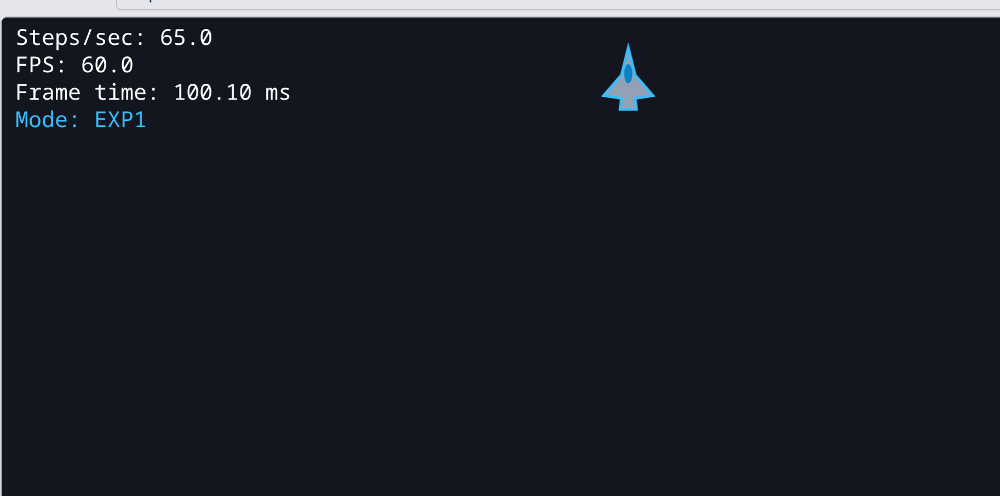
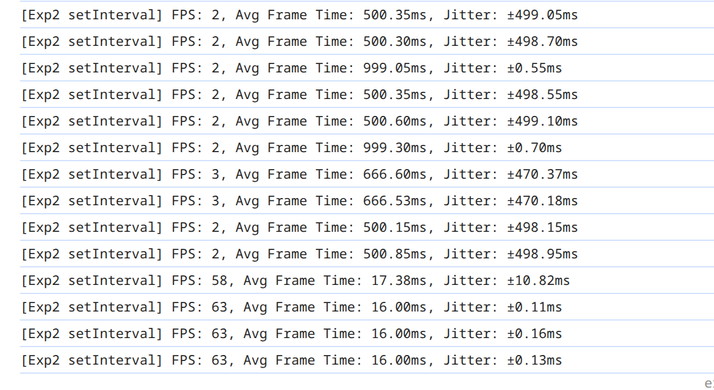
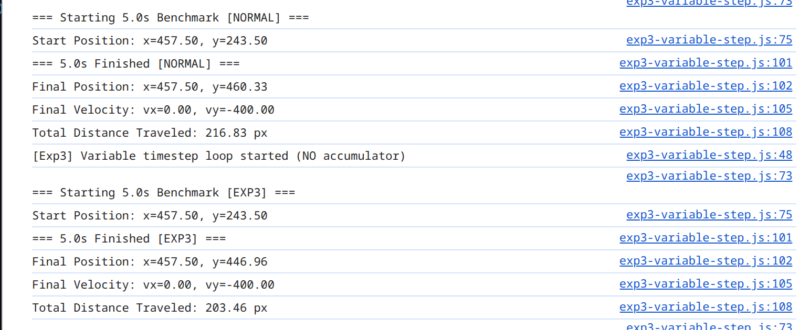
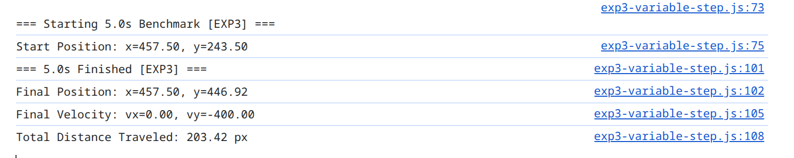

# MiG Flyer — Fixed-Step Physics Game Loop (`lab-01`)

A high-performance 2D flight simulation built with Vanilla JavaScript, Vite, and Biome. Features a deterministic 60 Hz game loop with `requestAnimationFrame` and an accumulator, render state interpolation, Newtonian flight dynamics, toroidal boundary wrapping, and an on-screen diagnostic HUD.

---

## 1. Architecture Overview

```
requestAnimationFrame
  └── tick(currentTime)
        ├── Calculate delta time (dt = (currentTime - lastTime) / 1000)
        ├── Clamp delta time (dt = Math.min(dt, 0.25))
        ├── accumulator += dt
        │
        ├── [SIMULATION PHASE: Fixed 60 Hz]
        │     └── while (accumulator >= FIXED_STEP)
        │           ├── keys = input.getState()
        │           ├── previousShip = currentShip
        │           ├── currentShip = integrate(currentShip, keys, FIXED_STEP)
        │           ├── currentShip = wrapArena(currentShip, width, height)
        │           ├── accumulator -= FIXED_STEP
        │           └── input.clearJustPressed()
        │
        ├── [INTERPOLATION & RENDER PHASE: Monitor Refresh Rate]
        │     ├── alpha = accumulator / FIXED_STEP
        │     ├── renderX = lerp(previousShip.x, currentShip.x, alpha)
        │     ├── renderY = lerp(previousShip.y, currentShip.y, alpha)
        │     ├── renderAngle = lerpAngle(previousShip.angle, currentShip.angle, alpha)
        │     ├── renderMIG(ctx, renderX, renderY, renderAngle, thrust)
        │     └── drawHUD(ctx, metrics)
        │
        └── requestAnimationFrame(tick)
```

### Module Responsibilities
- **`src/core/loop.js`**: Pure clock engine. Manages `requestAnimationFrame`, accumulator consumption at 60 Hz (`FIXED_STEP = 1/60`), delta time clamping (`0.25s`), and performance metrics (`steps/s`, `fps`, `frameTimeMs`).
- **`src/core/input.js`**: Keyboard capture closure. Isolates DOM keyboard listeners (`keydown`, `keyup`), maps controls (`WASD` / Arrows), and provides edge-triggered `justPressed` state for single-frame trigger detection.
- **`src/physics/ship.js`**: Pure Newtonian physics integration. Applies angular rotation, thrust vector acceleration, aerodynamic drag damping, and speed clamping. 100% pure function; zero DOM and zero canvas dependencies.
- **`src/physics/arena.js`**: Dedicated toroidal screen wrap module. Wraps coordinates across screen edges so the physics engine remains completely agnostic of display size.
- **`src/render/canvas.js`**: High-DPI canvas setup supporting `window.devicePixelRatio` for sharp rendering on Retina displays, and the diagnostic HUD overlay.
- **`src/render/math.js`**: Scalar `lerp` and shortest-arc `lerpAngle` to eliminate the 350° spin-around artifact across the $0^\circ / 360^\circ$ boundary.
- **`src/render/vehicle.js`**: Vector path rendering of the MiG fighter jet with animated thruster afterburner flame.

---

## 2. Flight Physics Tuning Log

| Parameter | Value | Why Chosen |
| :--- | :--- | :--- |
| **`thrustPower`** | `450 px/s²` | Responsive acceleration; jet gains speed quickly without unnatural instant snapping. |
| **`turnRate`** | `180 deg/s` | Exactly half a turn ($180^\circ$) per second; gives tight, controllable dogfight maneuvers. |
| **`drag`** | `0.8` | Aerodynamic damping; aircraft drifts with realistic inertia when releasing thrust, settling to a halt within ~2 seconds. |
| **`maxSpeed`** | `400 px/s` | High top speed, while preventing the aircraft from tunneling through boundaries during lag spikes. |

---

## 3. "Break It on Purpose" Experiments & Measurements

### Experiment 1: Synchronous 100 ms Frame Stall

A busy-wait loop (`while (performance.now() < t + 100) {}`) was inserted into the rendering pipeline every 60th frame.



#### Measured Data
- **Normal Frame Time**: `~16.6 ms`
- **Stall Frame Time**: **`100.10 ms`**
- **Simulation Steps**: `65.0 steps/s` (accumulator catches up after the stall)
- **Visual Observation**: The game visibly hitches and freezes completely once every second. Six full frames of visual motion are dropped simultaneously.

#### Event Loop Explanation
JavaScript operates on a single-threaded execution model with a shared Call Stack. The browser's rendering pipeline (style calculation, layout, paint, and compositor commit) only runs when the Call Stack is empty. 

When a synchronous 100 ms `while` loop runs:
1. The Call Stack is held hostage for 100 ms.
2. The Event Loop cannot advance to the Rendering phase.
3. Microtasks and macrotasks are deferred.
4. User interactions, scrolling, and DOM paints are frozen.

**Why it cannot be worked around on the same thread**: Because execution is synchronous, no timer, promise, or asynchronous callback can preempt the running loop. The thread is physically blocked until the while-loop condition evaluates to false and the execution frame pops from the call stack.

---

### Experiment 2: `setInterval(frame, 16)` vs `requestAnimationFrame`

The game loop was driven with `setInterval(frame, 16)` instead of `requestAnimationFrame`. Frame times, FPS, and jitter were measured over 10 seconds, followed by switching to an inactive background tab for 5 seconds.



#### Measured Data

| Tab State | FPS | Average Frame Time | Frame Jitter ($\sigma$) |
| :--- | :--- | :--- | :--- |
| **Active Tab** | `58 – 63 FPS` | `16.00 ms – 17.38 ms` | **$\pm 0.11\text{ ms} \rightarrow \pm 10.82\text{ ms}$** |
| **Background Tab (5s)** | **`2 – 3 FPS`** | **`500.15 ms – 999.30 ms`** | **$\pm 470.18\text{ ms} \rightarrow \pm 498.95\text{ ms}$** |

#### What is Jitter?
**Jitter** is the statistical variance (standard deviation) in the intervals between consecutive frames. Even if the average frame rate is ~60 FPS, high jitter means frames are delivered at irregular, clumpy intervals (e.g., 6 ms, then 28 ms), producing visual judder and stutter.

#### Event Loop Explanation
- **Active Tab**: `setInterval` enqueues callbacks into the **Macrotask Queue**. It is not synchronized with the hardware VSync refresh cycle of the monitor. Callbacks may execute right after a screen refresh, missing the deadline, or stack closely together, resulting in high jitter ($\pm 10.82\text{ ms}$).
- **Background Tab**: To conserve CPU and battery power, modern browser engines (Blink, Gecko, WebKit) aggressively throttle timer macrotasks (`setInterval` / `setTimeout`) in inactive tabs to a minimum delay of **1000 ms** (1 Hz). Consequently, frame rate collapsed to 2 FPS with frame times reaching ~999 ms.
- **Why `rAF` is Superior**: `requestAnimationFrame` is hooked directly into the browser compositor's VSync pulse. It executes callbacks immediately before the display renders, eliminates jitter, and cleanly pauses when the tab is hidden without queuing stale timer backlog.

---

### Experiment 3: Variable Timestep vs Fixed Accumulator (CPU 6× Throttling)

The accumulator was removed to run variable timestep physics (`simulate(dt)` called once per frame with the raw frame delta). A 5.0-second continuous thrust benchmark was performed unthrottled and under **6× CPU Slowdown** (Chrome DevTools Performance panel).




#### Benchmark Trajectory Data (5.0 Seconds Full Thrust)

| Configuration | Start Position $(x, y)$ | Final Position $(x, y)$ | Distance Traveled | Discrepancy |
| :--- | :--- | :--- | :--- | :--- |
| **Fixed Step [NORMAL]** | $(457.50, 243.50)$ | $(457.50, 460.33)$ | **`216.83 px`** | **Baseline** |
| **Variable Step [EXP3] (6× Throttled)** | $(457.50, 243.50)$ | $(457.50, 446.96)$ | **`203.46 px`** | **$-13.37\text{ px}$ Drift** |
| **Variable Step [EXP3] (Unthrottled)** | $(457.50, 243.50)$ | $(457.50, 446.92)$ | **`203.42 px`** | $-13.41\text{ px}$ Drift |

#### Event Loop & Mathematical Explanation
In numerical Euler integration:
$$v(t + \Delta t) = v(t) + a \cdot \Delta t$$
$$x(t + \Delta t) = x(t) + v(t) \cdot \Delta t$$

Because velocity damping ($v \cdot (1 - \text{drag} \cdot \Delta t)$) and acceleration are approximated linearly over discrete steps, the mathematical truncation error is proportional to $\Delta t$. 

- Under variable timestep, fluctuating frame rates alter the integration step size. Under 6× CPU throttling, frame deltas are six times larger, resulting in a **13.37 px trajectory drift**.
- With the **fixed accumulator loop** (`FIXED_STEP = 1/60`), the simulation runs the exact same discrete mathematical calculations regardless of CPU load, framerate, or monitor refresh rate. The trajectory remains 100% deterministic.

---

## 4. Reflection — Whiteboard Preparation

*(Questions for oral defense and whiteboard presentation)*

1. **Draw the runtime**: call stack, heap, Web APIs, task queue, microtask queue, render steps. Trace `setTimeout(f, 0);` `Promise.resolve().then(g);` through it.
2. **Why does a 100 ms synchronous loop freeze the whole page**, including CSS animations and scrolling in many cases? What can't JavaScript do about it from the same thread?
3. **Microtasks vs tasks**: state the rule for when each runs. Why can a microtask chain starve rendering while a `setTimeout` chain can't?
4. **Where does `requestAnimationFrame` run** relative to tasks, microtasks, and paint? Why is it better than `setInterval(fn, 16)` for animation — give three reasons.
5. **Explain the accumulator loop**. Why clamp the frame delta? What is alpha and what does the renderer do with it?
6. **Why must the simulation be deterministic**, and what does that have to do with multiplayer (Lab 5)?
7. **What does a closure capture** — values or variables? Show the `var`/`let` loop difference and explain it precisely.
8. **What changes when you add `type="module"` to a script tag?** Name five things.
